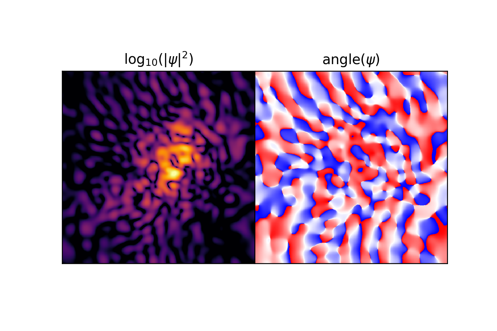

# quantumspectral-python
Spectral Solver for Schrodinger-Poisson Quantum System

## Create Your Own Quantum Mechanics Simulation (With Python)

### Philip Mocz (2020) Princeton Univeristy, [@PMocz](https://twitter.com/PMocz)

### [📝 Read the Algorithm Write-up on Medium](https://levelup.gitconnected.com/create-your-own-quantum-mechanics-simulation-with-python-51e215346798)

Simulate the Schrodinger-Poisson system with the Spectral Method


```
python quantumspectral.py
```


